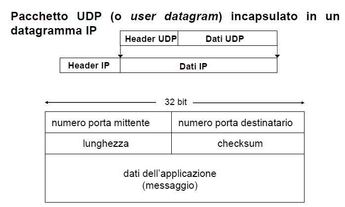
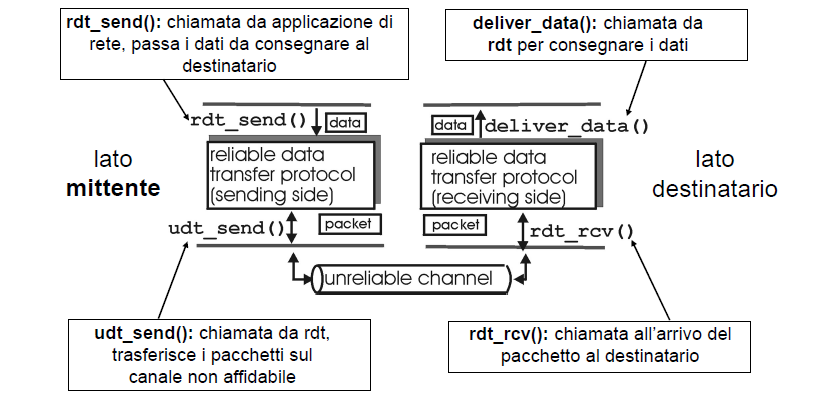
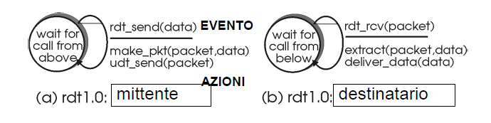
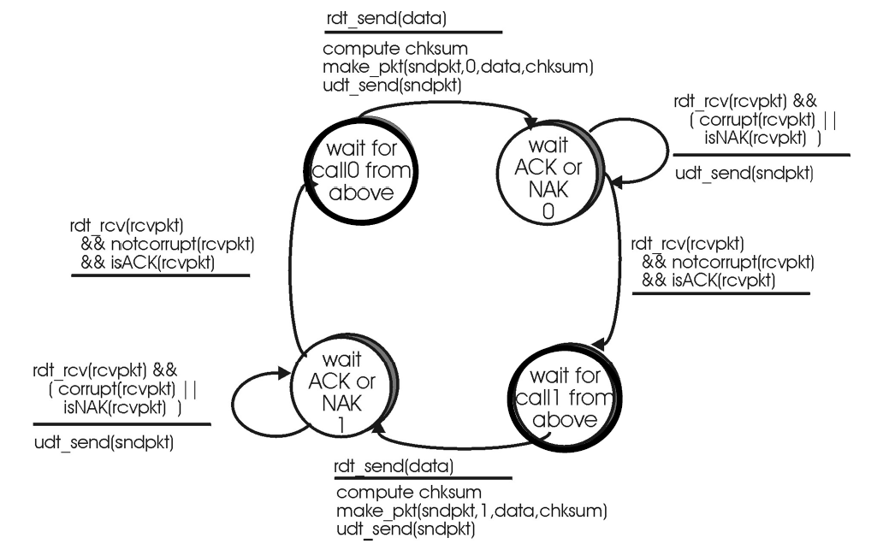
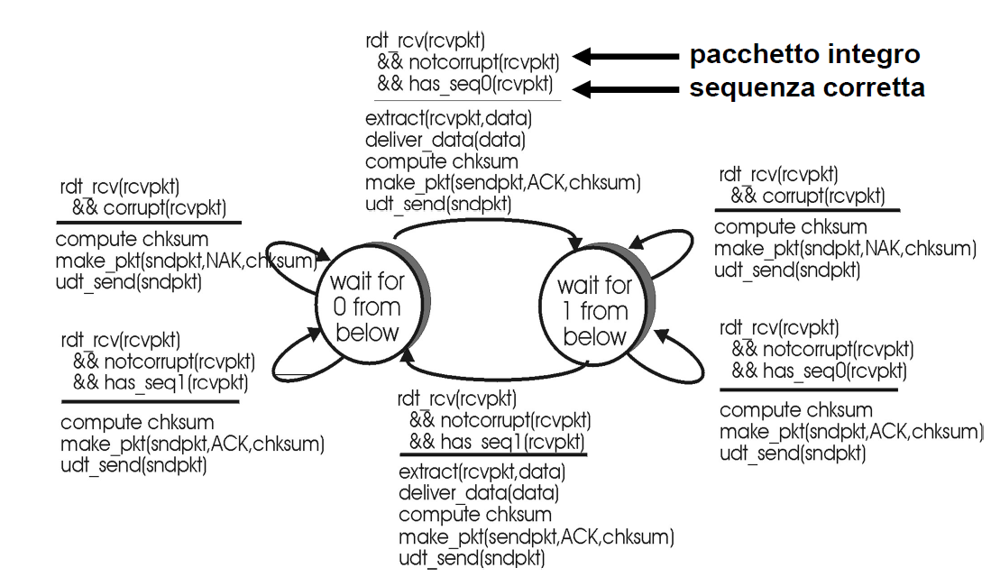
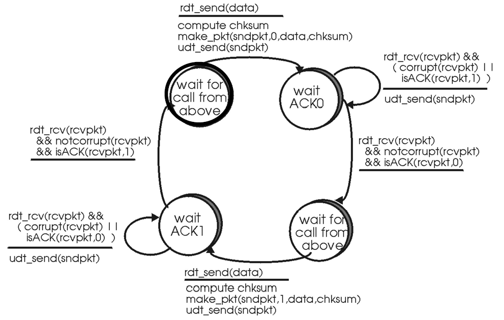
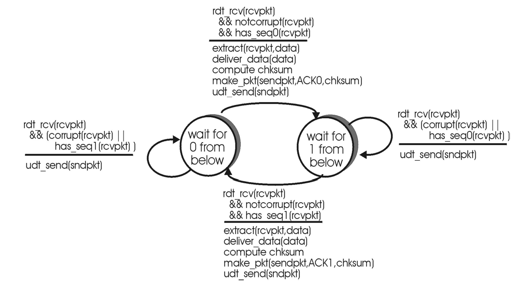
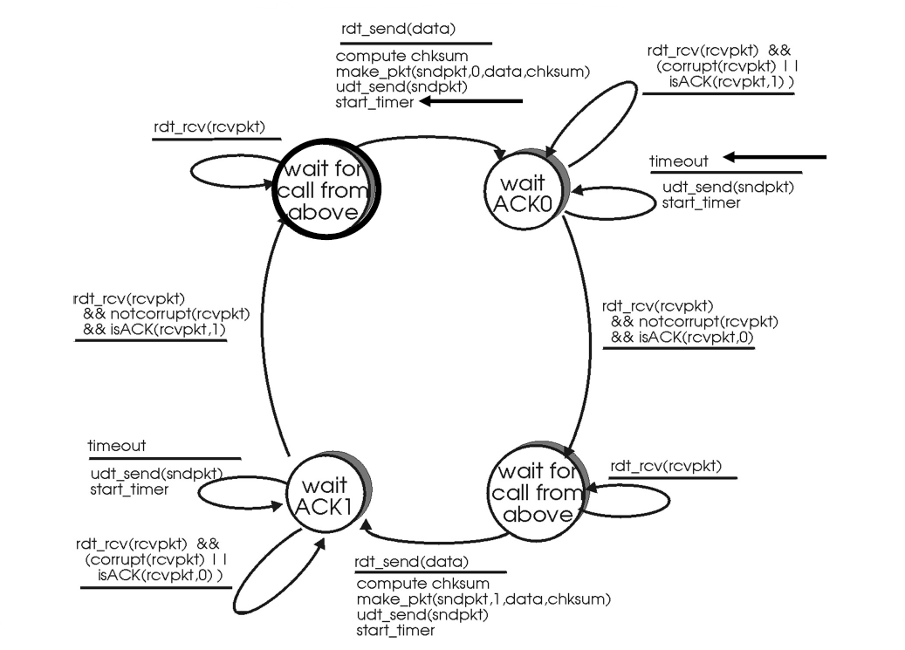

# Parte 5: Livello Trasporto - Servizi del livello trasporto e protocollo UDP

---
- [Parte 5: Livello Trasporto - Servizi del livello trasporto e protocollo UDP](#parte-5-livello-trasporto---servizi-del-livello-trasporto-e-protocollo-udp)
  - [Livello 4](#livello-4)
  - [Multiplazione e Demultiplazione](#multiplazione-e-demultiplazione)
  - [Indirizzo ip e numero di porta](#indirizzo-ip-e-numero-di-porta)
  - [Indirizzi](#indirizzi)
  - [Protocollo UDP](#protocollo-udp)
    - [Campi del pacchetto UDP](#campi-del-pacchetto-udp)
      - [Checksum UDP](#checksum-udp)
- [Livello trasporto - Fodamenti teorici del trasporto affidabile](#livello-trasporto---fodamenti-teorici-del-trasporto-affidabile)
  - [Ipotesi: Protocolli diversi per diversi canali](#ipotesi-protocolli-diversi-per-diversi-canali)
  - [Protocolli su canale affidabile](#protocolli-su-canale-affidabile)
    - [Formalismo: FSM](#formalismo-fsm)
      - [Ipotesi](#ipotesi)
  - [Trasferimento affidabile su canale con errori a livello bit](#trasferimento-affidabile-su-canale-con-errori-a-livello-bit)
      - [Trasferimento su un canale con errore nei bit (_rdt2.0_)](#trasferimento-su-un-canale-con-errore-nei-bit-rdt20)
    - [Problema](#problema)
      - [Protocollo rdt2.1: miglioramento di rdt2.0](#protocollo-rdt21-miglioramento-di-rdt20)
        - [Analisi del protocollo _rdt2.1_](#analisi-del-protocollo-rdt21)
          - [Automa lato mittente](#automa-lato-mittente)
          - [Automa lato destinatario](#automa-lato-destinatario)
      - [Protocollo rdt2.2: possibile miglioramento del protocollo rdt2.1](#protocollo-rdt22-possibile-miglioramento-del-protocollo-rdt21)
        - [Automa FSM per protocollo _rdt2.2- mittente_](#automa-fsm-per-protocollo-rdt22--mittente)
        - [Automa FSM per protocollo _rdt2.2- destinatario_](#automa-fsm-per-protocollo-rdt22--destinatario)
  - [Protocolli su canale con errori a livello di bit e perdita pacchetti](#protocolli-su-canale-con-errori-a-livello-di-bit-e-perdita-pacchetti)
    - [Trasferimento affidabile su canale con errore sui bit e perdita pacchetti (_protocollo rdt3.0_)](#trasferimento-affidabile-su-canale-con-errore-sui-bit-e-perdita-pacchetti-protocollo-rdt30)
- [Affidabilità del protocollo TCP](#affidabilità-del-protocollo-tcp)
  - [Meccanismi per affidabilità](#meccanismi-per-affidabilità)
  - [Come stimare il "time-out"](#come-stimare-il-time-out)
  - [Prestazioni](#prestazioni)
    - [Alcune definizioni](#alcune-definizioni)
  - [Implementazione di un protocollo di pipelining](#implementazione-di-un-protocollo-di-pipelining)
- [Sliding window](#sliding-window)
  - [Mittente](#mittente)
  - [Destinatario](#destinatario)
  - [Note](#note)
  - [Algoritmi per affidabilità del pipelining](#algoritmi-per-affidabilità-del-pipelining)
    - [_Go-Back-N_](#go-back-n)
    - [_Ritrasmissione selettiva_](#ritrasmissione-selettiva)
  - [TCP usa](#tcp-usa)

---

## Livello 4

- il livello 4 estende il servizio di consegna
  - IP protocollo di rete, TCP protocollo trasporto? **NO**
    - TCP è un componente del livello di trasporto della suite TCP/IP
    - L'altro componente è costituita dal protocollo UDP
    - estende il servizio di consegna ad un servizio di consegna a due processi
      applicativi
- Cosa aggiunge ad IP?
  - Processo multiplazione
    - multiple sorgenti dati vengono coinvogliate in
    - pacchetti aventi lo stesso
      sorgente
    - demultiplazione: ricevo divresi pacchetti da uno stesso indirizzo ip,
      devo capire a quale processo aplicativo consegnare i dati
  - Permette anche la rilevazione dell'errore
  - Principali protocolli sono UDP e TCP
    - TCP offre servizi aggiuntivi rispetto a UDP
      - no correzione!
      - Offre trasferimento affidabile dei dati
      - ... e controllo di congestione

## Multiplazione e Demultiplazione

- Multiplazione lato mittente
  - Capire a quale applicativo consegnare i dati.
- Per multiplazione e demultiplazione TCP e UDP includono due campi speciali
  nell'header del segmento
  _ informazioni su numero di porta
  _ del sorgente(applicativo mittente)
  _ del destinatario(applicativo destinatario)
  _ sono usati per multiplare e per demultiplare
- Numero di porta
  - Intero a due byte
  - Sono presenti alcuni numeri di porta detti well-known
    - tra 0 e 1023 riservati per protocolli applicativi noti
      - http: porta 80
      - Telnet: porta 23
      - SMTP: porta 25
      - DNS: porta 53
  - Registered ports -> 1024-49151
  - Dynamic or private ports -> 49152-65535

## Indirizzo ip e numero di porta

- Due processi che comunicano sulla stessa porta sono distinte in base al loro
  ip(sorgente) e possono essere distinti in base al numero di porta sorgente
  (SP).
- Due processi client, residenti su host diversi e che, per
  eventualità, usano lo stesso numero di porta sorgente (SP)
  per comunicare con lo stesso servizio applicativo, sono
  distinti in base al loro indirizzo IP
- Due processi client, residenti sullo stesso host per
  comunicare con lo stesso servizio applicativo, non essendo
  distinti in base al loro indirizzo IP, useranno diversi numeri di
  porta sorgente (SP) grazie all’assegnazione univoca del
  sistema operativo

## Indirizzi

- A livello network
  - [indirizzo IP $_x$, indirizzo IP $_y$]
- A livello trasporto
  - [porta$_w$, porta$_z$]
- Univocità dato dalla quadrupla:
  - [(indirizzo IP$_x$, porta$_w$),(indirizzo IP$_y$, porta$_z$)]

## Protocollo UDP

1. servizio mutli e demulti
2. **controllo** dell'errore
3. non garantisce nessuna consegna

- di tipo best effor
  - i pacchetti possono essere persi, consegnati in modo disordinato, duplicati

4. è un servizio connectionless
   - no handshaking tra mittente e destinatario del pacchetto UDP
   - ogni pacchetto UDP è trattato in modo indipendente dagli altri
     - come nel caso di IP

### Campi del pacchetto UDP

- numero di porta mittente (16bit)
- numero di porta destinatario (16bit)
- lunghezza (16 bit): dimensione in byte del pacchetto
  - lunghezza = header + dati
  - header: dimensione pari a 8 byte
- checksum
  - limitato all'header del datagramma IP
- dati: contiene il messaggio dal livello applicativo

#### Checksum UDP

- individuare errori nel pacchetto trasmesso
- Calcolato usando un numero di informazioni maggiori di quelle presenti
  nell'header UDP
  - Pseudo header UDP

Mittente
: _ Tratta i contenuti del pacchetto come sequenza di numeri interi a 16 bit
: _ Checksum = somma dei contenuti del pacchetto con complemento a 1
: \* Il mittente invia il valore del checksum nel campo checksum del paccehtto UDP

Destinatario
: _ Calcola il checksum del pacchetto ricevuto
: _ Controlla se il valore calcolato è uguale a quello del campo checksum
: _ NO -> Errore
: _ SI -> No Errore

- Come viene calcolato?
  - usando il complemento a 1 della somma di tutti i campi dello pseudo header
    e del pacchetto UDP

# Livello trasporto - Fodamenti teorici del trasporto affidabile

- Consente un trasporto
  - Affidabile
  - Orientato alla connessione
    - Pur usando un canale inaffidabile come internet!
    - da alle applicazioni l'idea di essere su un canale affidabile
- Fare comunicazioni sicure in un canale inaffidabile è la complessità
  principale del protocollo
  - il protocollo deve gestire questa inaffidabilità

## Ipotesi: Protocolli diversi per diversi canali

1. protocollo rdt1.0 completamente affidabile
2. Protocollo rdt2.x: Trasferimento su un canale con possibili errori sui bita
   - 2.0 - versione base
   - 2.1 - risolve due tipi di duplicazione
   - 2.2 - evita due tipi di ACK
3. Protocollo rdt3.0: Trasferimento su un canale con possibili errori sui bit e perdita di pacchetti

## Protocolli su canale affidabile

1. Trasferimento su canale completamente affidabile (prot. _rdt1.0_)

### Formalismo: FSM

- Uso del formalismo di macchine a stati finiti FSM per modellare il comportamento
  del mittente e del destinatario

#### Ipotesi

- Trasferimento dati unidirezionale
- Meccanismo STOP-AND-WAIT
  - Inviamo un pacchetto e aspettiamo di essere sicuri che il pacchetto sia
    arrivato prima di inviare un altro pacchetto
- Canale Affidabile
  - ne errori di bit ne perdita di pacchetti
- Definiamo un automa per il mittente e uno per il destinatario
  - Mittente invia dati sul canale sottostante
  - Destinatario legge dati sul canale sottostante

## Trasferimento affidabile su canale con errori a livello bit

#### Trasferimento su un canale con errore nei bit (_rdt2.0_)

- Il canale trasmissivo può modificare il valore di un bit
- Come recuperare l'errore?
  - _Acknowledgement_ (**_ACK_**): il destinatario comunica se il pacchetto ricevuto è OK
  - _Acknowledgement negativo_ (**_NAK_**) il destinatario comunica esplicitamente al mittene che il pacchetto ricevuto ha un errore
    - Il mittente quindi ritrasmette il pacchetto
- _rdt2.0_ introduce:
  - rilevamento dell'errore: **_checksum_**
  - Feedback del destinatario inviato al mittente

### Problema

- Se sono danneggiati i messaggi di ACK/NACK?
  - Il mittente non sa se il destinatario ha ricevuto o meno il pacchetto
  - _Prima soluzione_
    - Ritrasmettere il pacchetto
      - non funziona: possibile duplicazione dei pacchettio
  - _Seconda soluzione_
    - Inviare ACK/NACK in risposta a ACK/NACK
    - non funziona: rischio di ritrasmissioni continue
    <!-- slide 17 -->

- I protocolli rdt servono solo per capire le basi teoriche

#### Protocollo rdt2.1: miglioramento di rdt2.0

- Risolve i problemi del protocollo _rdt2.0_
- Aggiungo **numero di sequenza** ai pacchetti
  - Se ricevo nuovamente un pacchetto già ricevuto capisco di avere un
    duplicato
  - il mittente ritrasmette il pacchetto se il messaggio di ACK/NAK è danneggiato (e quindi scartato)
  - il destinatario scarta (nel senso che non consegna al livello superiore) i pacchetti duplicati 
- Nell'ipotesi di comunicazione STOP-AND-WAIT 
  - Mi basa un bit come numero di sequenza 
    -  Se numero di seq è lo steesso il mittente ha rispedito un pacchetto

##### Analisi del protocollo _rdt2.1_

- **Mittente**
  - Aggiungo ad ogni pacchetto un numero di sequenza
  - Due sequenze di numeri (0,1) sono abbastanza nel caso di ACK/NACK durante una trasmissioned i tipo STOP-AND-WAIT
  - Verifica anche se ACK/NACK è danneggiato
  - Serve il doppio degli stati rispetto a _rdt2.0_
    - Lo stato corrente deve ricordarsi se il pacchetto corrente ha un numero di sequenza pari a 0 o a 1
- **Destinatario**
  - Deve controllare se il pacchetto ricevuto è duplicato (lo stato consente di verificare se il numero di sequenza del pacchetto è 0 o 1)
  - Il destinatario può non sapere se il suo ultimo ACK/NAK è stato ricevuto correttamente dal mittente

###### Automa lato mittente

###### Automa lato destinatario

#### Protocollo rdt2.2: possibile miglioramento del protocollo rdt2.1

> Nel protocollo rdt2.1, per ogni pacchetto ricevuto, il destinatario deve inviare 
> sempre un pacchetto di ACK o NAK al mittente

- Possibile miglioramento:
  - Mandare solo ACK positivi per l'ultimo pacchetto ricevuto
    correttamente
    - Includo nel ACK il numero di seq dell'ultimo pacchetto ricevuto
      correttamente
      - **DESTINATARIO**
        - Se il pacchetto i ricevuto è corretto (giusta sequenza,pacchetto integro), inviare un ACK con etichetta i
        - Se il pacchetto i ricevuto non è corretto e il pacchetto i-1 era corretto, inviare un ACK con etichetta i-1 
      - **MITTENTE**
        - Se il mittente riceve due ACK per il pacchetto i-1, può dedurre che il destinatario non ha ricevuto correttamente il pacchetto i e quindi deve agire come se fosse un (NAK, i) 
          - Quindi ritrasmettere il pacchetto i

##### Automa FSM per protocollo _rdt2.2- mittente_

##### Automa FSM per protocollo _rdt2.2- destinatario_

## Protocolli su canale con errori a livello di bit e perdita pacchetti

- Il canale di trasmissione può causare errori sui bit e perdita di
  pacchetti (sia dati sia ACK)
- Come realizziamo una trasmissione affidabile?
  - Checksum
  - Numeri di sequenza
  - Ritrasmissioni
- Sono tutte cose utili ma non sufficienti
- _soluzione:_ coinvolgiamo il tempo

### Trasferimento affidabile su canale con errore sui bit e perdita pacchetti (_protocollo rdt3.0_)

- _Soluzione_: il mittente attende l'ACK per un intervallo di tempo
  "ragionevole" poi ritrasmette

  - Necessità
    1. Se il pacchetto è in ritardo ma non perso non devo ritrasmettere
    2. Usare un intervallo di tempo ragionevole

# Affidabilità del protocollo TCP

## Meccanismi per affidabilità

- Vogliamo rilevare se una comunicazione non sta andando a buon fine

 

1. __Acknowledgment positivo__
    - Meccanismo Stop&Wait
      - Mando pacchetto, aspetto ack, invio secondo pacchetto, etc...
2. __Time-out__
     - Dopo quanto tempo far scattare un time out e assumere che i dati non sono stati ricevuti 
3. __Ritrasmissione__
     - Decidere se riprovare a mandare il pacchetto
     - Se non ricevo l'ACK dopo un certo periodo(time-out) reinvio il pacchetto
     - Grazie ai sequence number il destinatario capisce se il pacchetto che riceve segue quelle precedenti o no

## Come stimare il "time-out"

- _Time out troppo breve_: ritrasmissioni non necessarie
- _Time out troppo lungo_: rezione troppo lenta
- __Unica certezza__
  - il time out deve essere maggiore del __Road Trip Time(RTT)__
    - Ovvero il tempo che ci mette il pacchetto ad arrivare a destinazione

 

- RTT varia continuamente
  - Fluttuazioni nelle condizioni del traffico di rete
  - I router possono cambiare nel percorso tra mittente e destinatario
- Una volta 
  - $Timeout = \beta * RTT_{avg}$
  - La raccomandazione era $\beta = 2$

 

- Nei protocolli attuali
  - Media pesata rispetto a finestra temporale
    - Tengo solo gli ultimi ___n___ campioni di RTT per effettuare il calcolo
- __Exponential Weighted Moving Avarage__
  - media "in movimento"
  - $EstimatedRTT(t) = (1-x)*EstimatedRTT(t-1)+x*SampleRTT(t)$

 

- $Timeout(t) = EstimatedRTT(t) + 4*Deviation(t)$
  - Dove:
    - Il 4 è un valore empirico
    - $Deviation(t) = [...]$
      - Più ho azzeccato le stime più la deviazione cala e viceversa
      - Introduco un fattore di correzione

## Prestazioni

### Alcune definizioni

- RTT
- Tempo di propagazione
- Utilizzazione: percentuale di utilizzazione di una risorsa in un intervallo di tempo

 

- Rate(throughput): quanti dati trasmetto in un unità di tempo
- L(pkt) = lunghezza pacchetto

 

- Tempo di trasmissione pacchetto
  - L(pkt)/Rate
- Tempo trasferimento pacchetto (_vista mittente_)
  - Quanto tempo il pacchetto ci mette effettivamente a essere ricevuto dal destinatario

<!-- img slide 66 -->

## Implementazione di un protocollo di pipelining

1. Serve un buffer lato mittente
2. Serve un buffer lato destinatario
3. Serve una "finestra a scorrimento"

# Sliding window

## Mittente

- Il mittente assegna a ciascun segmento un numero di sequenza Num_segm
- Ad ogni istante, ciascun mittente gestisce una finestra scorrevole sugli indici dei segmenti e solo quelli all'interno di essa possono essere trasmessi
  - La dimensione massima della finestra del mittente è controllata dal destinatario
  - Dimensione finestra: numero di pacchetti in pipe da inviare prima di aspettare una conferma
- Per gestire la sliding window il mittente usa tre variabili
  - __SWS__: dimensione della finestra
  - __LAR__: Last Ack Received
    - Ultimo segmento che il destinatario ha ricevuto di sicuro
  - __LSS__: Last Segment Sent
    - numero di sequenza dell'ultimo segmento inviato
  - Hanno la seguente relazione
    - LSS - LAR $\leq$ SWS

<!-- img slide 5-->

- Quando arriva ACK

## Destinatario

- Anche lui usa 3 variabili
  - __RWS__: _Receive Window Size_
    - limite superio
  - __LAS__: _Last Acceptable Segment_
  - __LSR__: ultimo pacchetto tale per cui io ho ricevuto anche tutti i precedenti
  - LAS - LSR $\leq$ RWS
- La sliding window del ricevente serve a gestire le consegne "non in ordine"
  - Il ritardo che impiegano i pacchetti ad arrivare potrebbe essere differente
    - es.: Ricevo pacc. 80 prima del 40
<!--Parte detta solo a voce-->

## Note

- Le finestre NON sono di dimensione fissa

## Algoritmi per affidabilità del pipelining

- "Andar male" = mancato arrivo di un pacchetto ACK entro il timeout

### _Go-Back-N_

- Mittente
  - Se scatta un time out per il primo pacchetto della finestra
    - Torno indietro di tutta quanta la finestra, rimando tutti i pacchetti che ho già provato ad inviare
- Destinatario
  - Deve inviare "ACK comulativi"
    - Conferma che sono stati inviati un certo numero di segmenti
    - Segmenti fuori sequenza vengono scartati
    - Non è necessario avere uno sliding window lato destinatario
  - Se mando tre pacchetti e ricevo solo ACK 3 so che il destinatario ha ricevuto anche primo e secondo pacchetto

### _Ritrasmissione selettiva_

- Il destinatario invia ACK relativo a ciascun segmento ricevuto correttamente

<!-- img slide 17 -->

- Pessimistico
  - Assume che i pacchetti out of order siano frequenti

## TCP usa

- No go-back-n no ritrasmissione selettiva
- Approccio con ACK comulativi
  - Due sliding window
  - Se il destinatario riceve un byte fuori sequenza
    - trasmette un ACK ma questo punta al primo byte che il destinatario si aspetta
      - "io sto ancora aspettando il primo pacchetto"