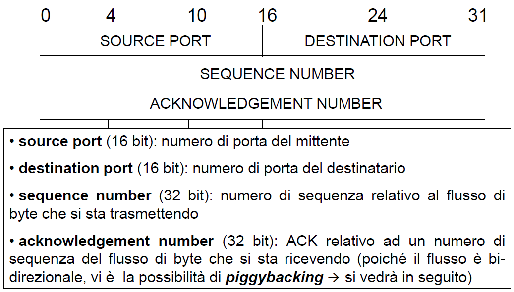
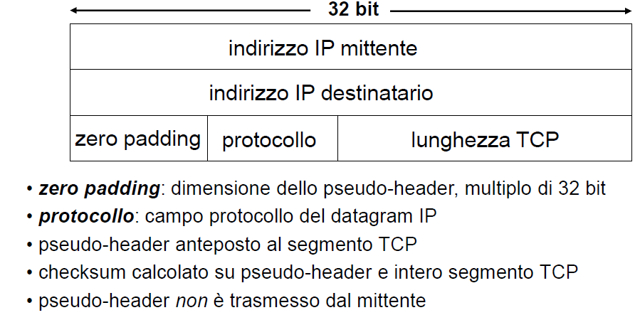

# Protocollo TCP

--- 

- [Protocollo TCP](#protocollo-tcp)
  - [1. Orientato alle connessioni](#1-orientato-alle-connessioni)
  - [2. Trasmissione byte stream](#2-trasmissione-byte-stream)
  - [3. Connessioni full duplex](#3-connessioni-full-duplex)
  - [4. Affidabile](#4-affidabile)
  - [5.a Trasmissione con buffer](#5a-trasmissione-con-buffer)
  - [5.b Controllo di congestione e di flusso](#5b-controllo-di-congestione-e-di-flusso)
  - [5.c Uso del buffer](#5c-uso-del-buffer)
  - [Segmento TCP](#segmento-tcp)
    - [Formato del segmento TCP](#formato-del-segmento-tcp)
  - 
  - 
  - 
    - [Checksum TCP](#checksum-tcp)
    - [Negoziazione del MSS](#negoziazione-del-mss)
    - [Numeri di sequenza e acknowledgment](#numeri-di-sequenza-e-acknowledgment)
  - [Instaurare e chiudere una connessione TCP](#instaurare-e-chiudere-una-connessione-tcp)
    - [Instaurazione](#instaurazione)
  - [Chiusura della connessione](#chiusura-della-connessione)
  - [Chiusura brusca della connessione](#chiusura-brusca-della-connessione)

---

- TCP offre un livello di trasporto affidabile e orientato alla connessione
- Serivizi in più rispetto ad UDP:
  - orientato alla connessione
    - Instaurazione, utilizzo e chiusura della connessione
  - orientato al flusso di dati
    - Considera flusso dati da host fino al destinatario
  - trasferimento con buffer
    - Dati memorizzati in un buffer e poi inseriti in un pacchetto quando buffer è pieno
  - connessione full duplex
    - Quando la connessione viene instaurata è possibile il trasferimento contemporaneo in entrambe le direzioni
- Cosa non garantisce TCP
  - Comunicazioni in tempo reale
  - Garanzia di disponibilità di banda tra mittente e destinatario
  - Multicast affidabile
    - Un mittente, molti destinatari
- Problemi al livello TCP
  - ...
  - Eterogeneità tempi di trasmissione
    - Meccanismo di timeout adattivo
  - Possibili ritardi molto lunghi nella rete
    - Gestire pacchetti molto vecchi
  - Possibilità di avere mittente e destinatario...
  - ...

## 1. Orientato alle connessioni

- Viene creata una connessione tra i due processi su host prima del trasferimento di qualsiasi dato tra le applicazioni
- Viene chiusa dopo il completamento del trasferimento dei dati
- 3 fasi
  - Instaurazione
  - Utilizzo
  - Chiusura
- Processo applicativo viene avvisato nel momento in cui
  - Non si riesce a stabilire la connessione
  - La connessione viene interrotta bruscamente

## 2. Trasmissione byte stream

- Connessione trattata come un flusso di byte continua da mittente a destinatario

> unità di trasmissione è il byte

1. Mittente scrive byte
2. Il livello tcp per inviarli accorpa i byte in un _segmento tcp_
3. Il livello IP incapsula ogni segmento TCP in un datagram IP
4. Il destinatario legge byte

## 3. Connessioni full duplex

- TCP può effettuare trasferimenti contemporanei in entrambe le direzioni in
  una stessa sessione
  - Ai processi questi trasferimenti appaiono come due data stream non
    correllati
- Le ultime versioni del TCP consentono di sovrapporre comunicazioni di dati e di controllo
  - Invio di informazioni di controllo (es.: ACK) insieme ai dati utente
  - viene detto **PIGGYBANKING**
    - _Io ricevo un pacchetto, devo rispondere con un ack ma anche mandare dei dati a mia volta quindi mando dati e ack_
     
## 4. Affidabile

- Trasferimento ordinato di stream di dati
  - ACK + time-out + (ritrasmissione)
- Ogni trasmissione andata a buon fine viene notificata dal ricevente
  - ACK!
- Se mittente non riceve ack entro un _time-out_ il mittente ritrasmette i dati
- Acknowledgment e ritrasmissioni dovute ad eventuali perdite sono gestite in modo trasparente rispetto al processo applicativo

## 5.a Trasmissione con buffer

- Il layer TCP deve usare necessariamente un buffer
  - (ricorda i problemi dei vari rdt...)
- Buffer consente di ovviare a:
  - Asincronia
  - Tempi di trasmissione differenti
  - Capacità di invio e ricezione differenti
  - Segmenti persi o fuori ordine

## 5.b Controllo di congestione e di flusso

- Il livello TCP è responsabile della gestione del buffering dei dati e di determinare quando è tempo di inviare un certo insieme di dati
- _Congestion control_
  - mittente deve diminuire tasso di trasmissione dei pachetti quando la
  connessione è già congestionata
- _Flow control_ 
  - L'host mittente non deve sovraccaricare il destinatario

## 5.c Uso del buffer

1. Dati applicazione messi in un buffer e poi inseriti in un segmento tcp quando il segmento è pieno
  - MSS: Maximum segment size
    - Viene concordato o di default dipende dall'implementazione TCP
2. Il segmento, a livello logico, viene poi inserito nel buffer del destinatario 
   - in realtà, viene incapsulato in un datagram IP, spedito via rete e dopo aver attraversato i vari livelli, arriva nel buffer TCP di destinazione
    
## Segmento TCP

### Formato del segmento TCP

- Ovvero l'insieme di dati che il livello TCP chiede di trasferire al livello IP
- Ogni seg contiene
  - _**Payload**_: dati del byte stream
  - _**Header**_: informazioni di controllo per identificare i byte dati

---

---

---

### Checksum TCP

- Usato per rilevare errori nei dati trasportati
- calcolato usando un maggior numero di informazioni di quelle presenti nell’header TCP (vi sono anche informazioni IP)
 

### Negoziazione del MSS

- garantire che il segmento entri nei rispettivi buffer
- evitare frammentazione al livello h2n
- sfruttare al meglio la banda

### Numeri di sequenza e acknowledgment

- Il primo Initial sequence number è pseudocasuale
- I successivi sn sono offset del primo byte del fusso dati inviati dal
  mittente

## Instaurare e chiudere una connessione TCP

### Instaurazione

- Paradigma client server
  - Server in attesa di connessioni
  - Client vengono attivati nel momento in cui c'è necessità di aprire una
  connessione
- Inizzializzazione variabili TCP

- Quando un client vuole aprire connessione invia un pacchetto SYN
  - Nell'header devo anche mettere la porta del server di destinazione
  ovvero quella su cui il server è in ascolto
  - L'indirizzo IP non compete al protocollo TCP

- SYN include
  - Initial Sequence number del client
    - Un numero di 32 bit
    - Scelto in modo pseudo-casuale
  - Maximum Receive Window del client per evitare di venire sovraccaricato
  - Maximum segment size
- Il pacchetto SYN non ha il payload ma solo il TCP header
- In risposta il server manderà un pacchetto SYN che include anche il flag
  ACK settato a 1
  - Include anche:
    - ACK del server: client_ISN+1
    - MRW
    - MSS
    - Anche in questo caso non c'è nessun payload
- __Three way handshake__

## Chiusura della connessione

- Può avvenire lato client o lato server
- Con il pacchetto con il flag FIN settato a 1

## Chiusura brusca della connessione

- Mediante un reset
- Flag RST=1
- Il nodo destinatario chiude immediatamente la connessione
